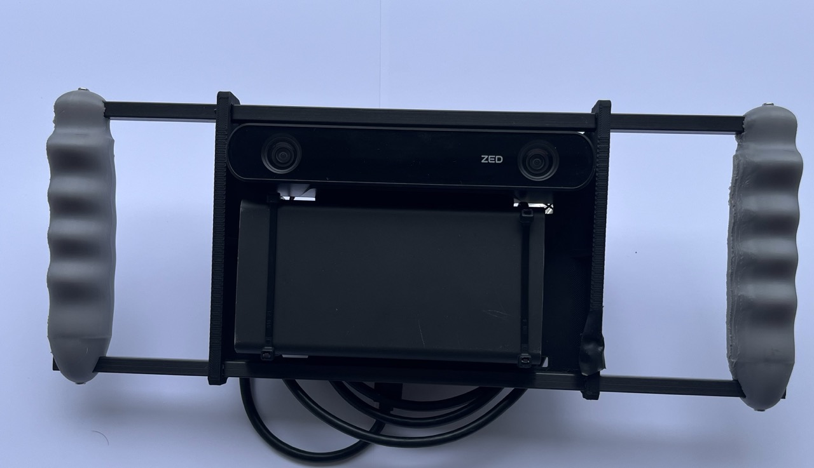
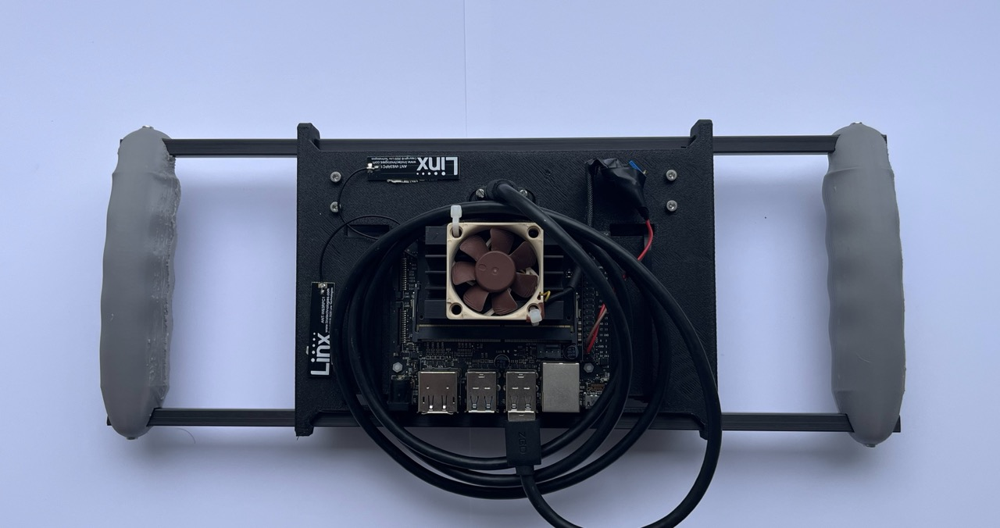
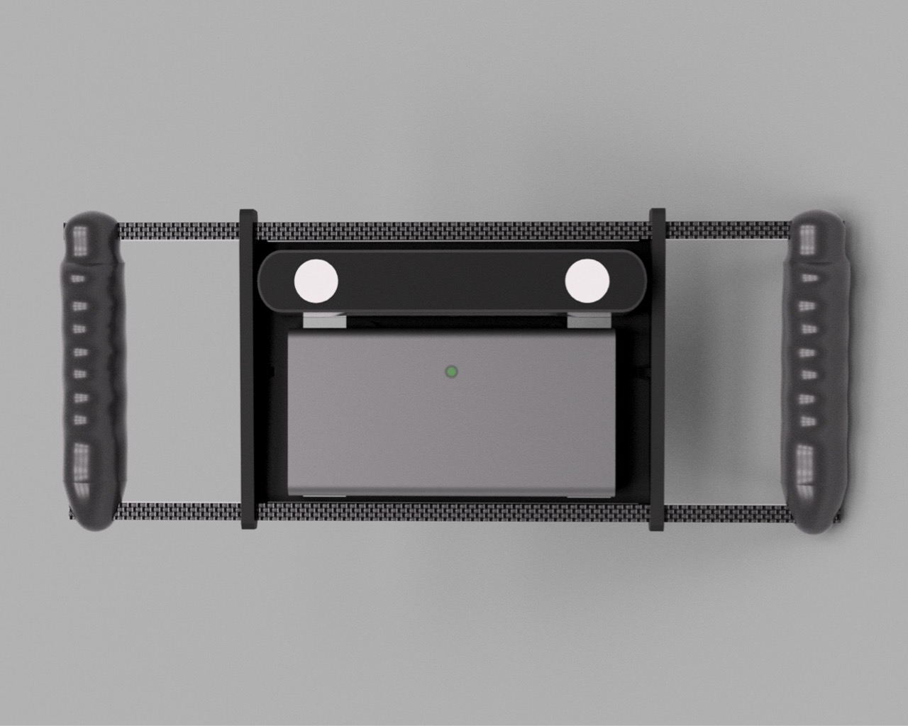

# stereo_capture_rig
Simple stereo camera rig for SfM and SLAM datasets.

| Harware | Name | Link |
| ------ | -------- | --------------------- | 
| Camera  | ZED 2i | https://www.stereolabs.com/en-no/products/zed-2 |
| Single-board Computer | Jetson Nano 2gb (EoL) | https://developer.nvidia.com/embedded/learn/get-started-jetson-nano-2gb-devkit |
| Cooling Fan | Noctua NF-A4x10 FLX 40mm | https://www.komplett.no/product/770799?noredirect=true | 
| Powebank | Sandstrøm 21000 mAh | NA | 
| Carbon Fiber Rods | 8mm (7mm) Carbon Fibre Square Box Section | https://www.easycomposites.co.uk/8mm-7mm-carbon-fibre-box-section |

## Software

Software targes ZED SDK 3.x, CUDA 10.2, GCC 7.5 (C++14), but could easily be ported to support newer versions. 

### Usage

Recording a dataset:

zed_record [out_dir] [options]
  --out DIR            output directory     (default "zed_rec")
  --mode 2k15|1080p30  resolution/fps       (default 2k15)
  --duration MINUTES   run length, minutes  (default 0 = until Ctrl+C)
  --compression h265|h264|lossless          (default h265)

Exporting to COLMAP or EuRoC format:

The export tool reads a directory produced by zed_record: /recording.svo, /imu0/data.csv, /SN<serial>.conf

Both formats export UNRECTIFIED (i.e. raw) images. This is because COLMAP and EuRoC are both designed around raw images + a distortion model, not pre-rectified ones.

Exporting COLMAP format:

***--format colmap***

Outputs:

cam*/data/.png
cameras.txt (PINHOLE by default, or OPENCV via --camera-model)
rig_config.json
cam0_list.txt cam1_list.txt
reconstruct.sh (Script to reconstruct using COLMAP)
imu0/data.csv

***--format euroc***

Outputs:

mav0/cam0/data/*.png  mav0/cam1/data/*.png
mav0/cam{0,1}/sensor.yaml
mav0/imu0/data.csv 

## Hardware files

The complete 3D model of the capture rig has been included in the ./hardware folder. The 3D-printable files have been included as separate 3mf files compatible with most commercial slicers for 3D printers.
